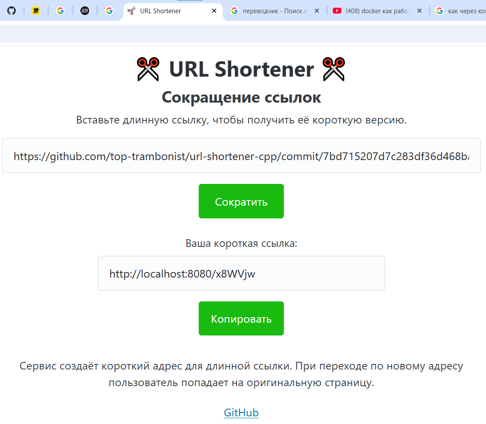

# ✂️ URL Shortener (C++20, Crow, SQLite, Docker)

[🇷🇺 По-русски](#-описание-проекта-russian) | [🇬🇧 In English](#-project-description-english)

---

<p align="center">
  
</p>

## 🇷🇺 Описание проекта (Russian)

URL Shortener — небольшой веб-сервис для сокращения длинных ссылок, написанный на **C++20**.

Пользователь вводит исходный URL, сервер генерирует короткий шестисимвольный код и сохраняет соответствие в базе данных SQLite. При переходе по короткой ссылке сервер находит исходный URL и возвращает HTTP-redirect `302`, после чего браузер автоматически открывает оригинальный ресурс.

Проект поддерживает постоянное хранение данных, защиту от коллизий коротких кодов, повторное использование уже созданного кода для одинакового URL, сборку через CMake и запуск в Linux-контейнере Docker.

### 🚀 Ключевые особенности и архитектура

- **Crow** — лёгкий C++ web framework, который отвечает за HTTP-сервер, маршрутизацию и формирование HTTP-ответов. В проекте реализованы маршруты для главной страницы, сокращения URL, статических файлов и перехода по короткому коду.

- **HTTP routing** — сервер обрабатывает несколько типов запросов:
  - `GET /` — выдаёт главную HTML-страницу;
  - `POST /shorten` — получает длинный URL и возвращает короткую ссылку;
  - `GET /<code>` — ищет исходный URL и выполняет redirect;
  - `/static/...` — отдаёт CSS и изображения.

- **HTTP 302 Redirect** — короткая ссылка не содержит исходный URL внутри себя. Короткий код используется как ключ для поиска в базе данных. После нахождения оригинального адреса сервер отвечает статусом `302` и заголовком `Location`, а браузер сам выполняет переход.

- **SQLite** — встроенная реляционная база данных. Она хранит соответствия между коротким кодом и исходным URL в файле `data/urls.db`. Отдельный сервер базы данных не требуется: SQLite работает непосредственно внутри приложения.

- **Repository pattern** — работа с базой вынесена в отдельный класс `UrlRepository`. Класс `Shortener` отвечает за бизнес-логику сокращения ссылок, а `UrlRepository` — за SQL-запросы, сохранение и поиск данных. Это отделяет логику приложения от способа хранения данных.

- **Prepared statements** — SQL-запросы используют параметры через SQLite API вместо ручной конкатенации пользовательских строк. Это корректно передаёт данные в запрос и защищает от SQL injection.

- **Защита от коллизий** — если генератор случайно создаёт уже существующий короткий код, приложение генерирует новый код вместо перезаписи старой ссылки.

- **Повторное использование URL** — если пользователь повторно вводит URL, который уже есть в базе, сервер возвращает существующий короткий код вместо создания нового.

- **Валидация URL** — HTML-поле `type="url"` выполняет клиентскую проверку в браузере, а backend дополнительно принимает только адреса, начинающиеся с `http://` или `https://`.

- **Потокобезопасность** — доступ к общей логике сокращения и SQLite-соединению защищён через `std::mutex` и `std::lock_guard`, чтобы параллельные HTTP-запросы не изменяли общее состояние одновременно.

- **HTMX** — отправляет форму на `POST /shorten` без полной перезагрузки страницы и вставляет HTML-ответ сервера в блок результата.

- **Pico CSS + собственный CSS** — Pico используется как минимальная база стилей, а собственный CSS отвечает за расположение элементов, размеры формы, кнопки и внешний вид интерфейса.

- **JavaScript Clipboard API** — кнопка «Копировать» помещает сгенерированную короткую ссылку в буфер обмена браузера.

- **Кроссплатформенность** — Windows-специфичная настройка консоли подключается только через `#ifdef _WIN32`, поэтому тот же исходный код может собираться в Linux.

- **CMake** — описывает сборку приложения, стандарт C++20, исходные файлы и зависимости Crow/SQLite. Проект не зависит от конкретного `.sln` или `.vcxproj` Visual Studio.

- **Docker** — проект собирается внутри Linux-окружения Ubuntu через multi-stage Docker build. На первой стадии устанавливаются компилятор, CMake, vcpkg, Crow и SQLite; в финальный image попадает только готовое приложение, web-файлы и runtime-зависимости.

- **Docker Volume** — каталог `/app/data` можно подключить к постоянному Docker volume. Благодаря этому `urls.db` сохраняется даже после удаления или пересоздания контейнера.

### 💻 Сборка и запуск

#### Способ 1. Docker — рекомендуемый способ для разных ОС

Требуется установленный и запущенный Docker Desktop или Docker Engine.

Собрать Linux-image:

```bash
docker build -t url-shortener .
```

Создать постоянный volume для SQLite:

```bash
docker volume create url-shortener-data
```

Запустить контейнер:

```bash
docker run --name url-shortener -p 8080:8080 -v url-shortener-data:/app/data url-shortener
```

После запуска открыть и пользоваться сервером:

```text
http://localhost:8080
```

Остановить контейнер:

```bash
docker stop url-shortener
```

Снова запустить уже созданный контейнер:

```bash
docker start url-shortener
```

Если контейнер был удалён, можно создать новый с тем же volume — сохранённые ссылки останутся в `url-shortener-data`.

#### Способ 2. Локальная сборка через CMake + vcpkg

Необходимы:

- компилятор с поддержкой C++20;
- CMake 3.20+;
- vcpkg;
- Crow;
- SQLite3.

Установить зависимости через vcpkg.

Windows x64:

```powershell
vcpkg install crow:x64-windows sqlite3:x64-windows
```

Linux x64:

```bash
vcpkg install crow:x64-linux sqlite3:x64-linux
```

Настроить проект через CMake:

```powershell
cmake -S . -B build -DCMAKE_TOOLCHAIN_FILE=C:/dev/vcpkg/scripts/buildsystems/vcpkg.cmake
```

Путь к `vcpkg.cmake` нужно заменить на путь к vcpkg на конкретном компьютере.

Собрать Debug-версию на Windows:

```powershell
cmake --build build --config Debug
```

Запустить из корня проекта:

```powershell
.\build\Debug\UrlShortener.exe
```

Для single-config генераторов на Linux можно использовать:

```bash
cmake -S . -B build \
  -DCMAKE_BUILD_TYPE=Release \
  -DCMAKE_TOOLCHAIN_FILE=/path/to/vcpkg/scripts/buildsystems/vcpkg.cmake

cmake --build build
./build/UrlShortener
```

После запуска приложение доступно по адресу:

```text
http://localhost:8080
```

> Файл `data/urls.db` создаётся автоматически при первом запуске и не должен храниться в Git-репозитории.

---

## 🇬🇧 Project Description (English)

URL Shortener is a small web service for shortening long URLs, written in **C++20**.

A user submits an original URL, the server generates a six-character short code and stores the mapping in an SQLite database. When the short URL is opened, the server looks up the original URL and returns an HTTP `302` redirect, allowing the browser to navigate to the original resource automatically.

The project supports persistent storage, short-code collision handling, reuse of an existing code for duplicate URLs, CMake-based builds and Linux containerization with Docker.

### 🚀 Key Features and Architecture

- **Crow** — a lightweight C++ web framework responsible for the HTTP server, routing and HTTP responses. The application defines routes for the main page, URL shortening, static assets and short-code redirects.

- **HTTP routing** — the server handles several request types:
  - `GET /` — serves the main HTML page;
  - `POST /shorten` — accepts the original URL and returns a short URL;
  - `GET /<code>` — looks up the original URL and redirects the client;
  - `/static/...` — serves CSS and image assets.

- **HTTP 302 Redirect** — the original URL is not encoded inside the short code. The code is used as a database key. Once the original URL is found, the server responds with status `302` and a `Location` header, and the browser performs the redirect.

- **SQLite** — an embedded relational database used to persist URL mappings in `data/urls.db`. No separate database server is required because SQLite runs directly inside the application process.

- **Repository pattern** — database access is isolated in the `UrlRepository` class. `Shortener` contains the URL-shortening business logic, while `UrlRepository` is responsible for SQL queries, persistence and lookup operations.

- **Prepared statements** — SQL queries use bound parameters through the SQLite API instead of concatenating user input directly into SQL strings. This safely passes values to SQLite and protects against SQL injection.

- **Collision handling** — if the random generator produces a short code that already exists, another code is generated instead of overwriting the existing URL mapping.

- **Duplicate URL reuse** — if the same original URL is submitted again, the server returns the existing short code instead of generating another one.

- **URL validation** — the HTML `type="url"` input provides client-side validation, while the backend additionally accepts only URLs beginning with `http://` or `https://`.

- **Thread safety** — access to shared shortening logic and the SQLite connection is protected with `std::mutex` and `std::lock_guard`, preventing concurrent requests from modifying shared state at the same time.

- **HTMX** — submits the shortening form to `POST /shorten` without a full page reload and injects the returned HTML fragment into the result block.

- **Pico CSS + custom CSS** — Pico provides lightweight base styling, while custom CSS controls layout, dimensions, spacing and the visual appearance of the application.

- **JavaScript Clipboard API** — the Copy button places the generated short URL into the browser clipboard.

- **Cross-platform source code** — Windows-specific console configuration is guarded by `#ifdef _WIN32`, allowing the same source code to compile on Linux.

- **CMake** — defines the C++20 target, source files and Crow/SQLite dependencies. The project is not tied to a particular Visual Studio `.sln` or `.vcxproj` file.

- **Docker** — the application is built inside an Ubuntu-based Linux environment using a multi-stage Docker build. The builder stage installs the compiler, CMake, vcpkg, Crow and SQLite, while the final image contains only the compiled application, web assets and runtime dependencies.

- **Docker Volume** — `/app/data` can be mounted to a persistent Docker volume so that `urls.db` survives container removal and recreation.

### 💻 Build and Run

#### Method 1. Docker — recommended for different operating systems

Docker Desktop or Docker Engine must be installed and running.

Build the Linux image:

```bash
docker build -t url-shortener .
```

Create persistent SQLite storage:

```bash
docker volume create url-shortener-data
```

Run the container:

```bash
docker run --name url-shortener -p 8080:8080 -v url-shortener-data:/app/data url-shortener
```

Open:

```text
http://localhost:8080
```

Stop the container:

```bash
docker stop url-shortener
```

Start the existing container again:

```bash
docker start url-shortener
```

If the container is removed, a new container can be created with the same volume and the saved URLs will remain in `url-shortener-data`.

#### Method 2. Local build with CMake + vcpkg

Requirements:

- a compiler with C++20 support;
- CMake 3.20+;
- vcpkg;
- Crow;
- SQLite3.

Install dependencies through vcpkg.

Windows x64:

```powershell
vcpkg install crow:x64-windows sqlite3:x64-windows
```

Linux x64:

```bash
vcpkg install crow:x64-linux sqlite3:x64-linux
```

Configure the project with CMake:

```powershell
cmake -S . -B build -DCMAKE_TOOLCHAIN_FILE=C:/dev/vcpkg/scripts/buildsystems/vcpkg.cmake
```

Replace the vcpkg toolchain path with the correct path on the local machine.

Build the Debug configuration on Windows:

```powershell
cmake --build build --config Debug
```

Run from the project root:

```powershell
.\build\Debug\UrlShortener.exe
```

For single-config generators on Linux:

```bash
cmake -S . -B build \
  -DCMAKE_BUILD_TYPE=Release \
  -DCMAKE_TOOLCHAIN_FILE=/path/to/vcpkg/scripts/buildsystems/vcpkg.cmake

cmake --build build
./build/UrlShortener
```

After startup, the application is available at:

```text
http://localhost:8080
```

> `data/urls.db` is created automatically on first startup and should not be committed to the Git repository.
